为学习 VMware 虚拟化基本知识, 拿 Google 翻译了 [VMware Infrastructure Architecture Overview](https://www.vmware.com/pdf/vi_architecture_wp.pdf), 发现目前机器翻译的水平已经挺好了, 翻译后直接可以不太费力的读通, 之后我改了一共不到十个字

## VMware Infrastructure 架构概述

**VMware® Infrastructure是业界首个完整的基础架构虚拟化套件**，允许企业和小型企业通过虚拟化转变，管理和优化其IT系统基础架构。VMware Infrastructure在集成产品中提供全面的虚拟化，管理，资源优化，应用程序可用性和操作自动化功能。

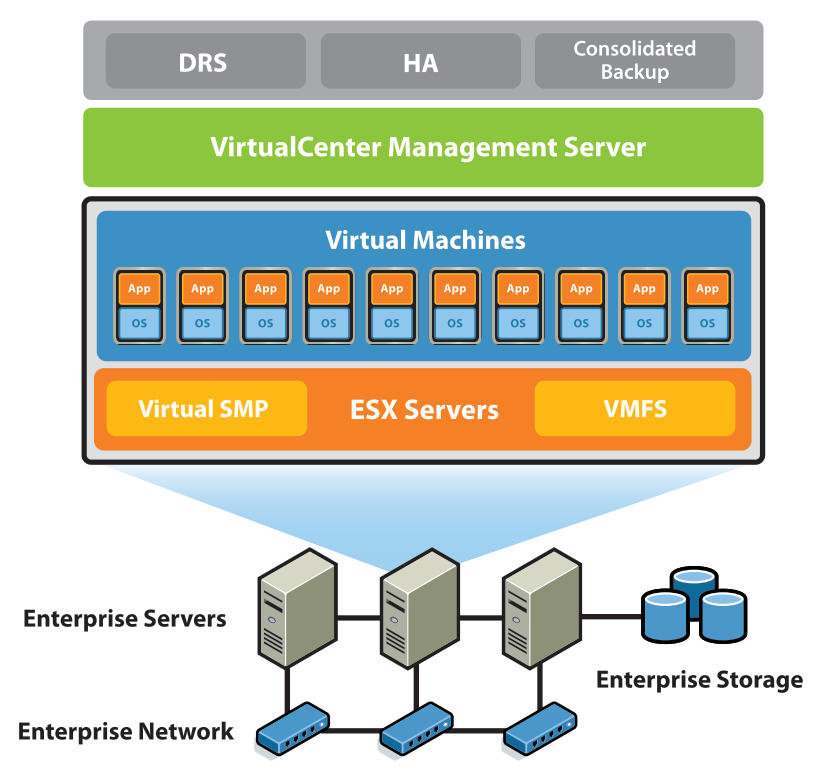

图1-1：VMware Infrastructure

VMware Infrastructure包括以下组件，如图1-1所示：

- VMware ESX Server - 经过生产验证的虚拟化层，运行在物理服务器上，抽象处理器，内存，存储和网络资源，以供应给多个虚拟机
- VMware虚拟机文件系统（VMFS） - 用于虚拟机的高性能群集文件系统
- VMware虚拟对称多处理（SMP） - 允许单个虚拟机同时使用多个物理处理器
- VirtualCenter Management Server - 配置，配置和管理虚拟化IT基础架构的中心点
- Virtual Infrastructure Client（VI Client） - 允许管理员和用户从任何Windows PC远程连接到VirtualCenter Management Server或单个ESX Server安装的界面
- Virtual Infrastructure Web Access - 用于虚拟机管理和远程控制台访问的Web界面
- VMware VMotion™ - 支持将运行中的虚拟机从一台物理服务器实时迁移到另一台物理服务器，无需停机，具有持续服务可用性和事务完整性
- VMware High Availability（HA） - 为在虚拟机中运行的应用程序提供易于使用且经济高效的高可用性。如果服务器发生故障，受影响虚拟机将在具有备用容量的其他生产服务器上自动重启
- VMware Distributed Resource Scheduler（DRS） - 智能地为虚拟机的硬件资源集合动态分配和平衡计算容量
- VMware Consolidated Backup - 为虚拟机的无代理备份提供易于使用的集中式设施。它简化了备份管理并减少了ESX Server安装的负载
- VMware Infrastructure SDK - 为VMware和第三方解决方案提供标准接口，以访问VMware Infrastructure

什么是虚拟化以及什么是虚拟机？

虚拟化是一个抽象层，它将物理硬件与操作系统分离，以提供更高的IT资源利用率和灵活性。虚拟化允许多个虚拟机，异构操作系统（例如，Windows 2003 Server和Linux）和应用程序在同一物理机器上并行运行。

虚拟机是由软件表示的物理机器。它有自己的一组虚拟硬件（例如，RAM，CPU，NIC，硬盘等），在其上加载操作系统和应用程序。无论实际的物理硬件组件如何，操作系统都会看到一致的标准化硬件集。VMware虚拟机包含高级硬件功能，如64位计算和虚拟对称多处理。

有关虚拟化的更多信息，请阅读虚拟化概述VMware白皮书。

> [VirtualizationOverview](https://www.vmware.com/pdf/virtualization.pdf)
> 这种页面风格的 pdf 都是很早以前的, 应该变化不大

以下部分描述了VMware Infrastructure的体系结构，从构成其物理拓扑的元素开始，然后是VMware Infrastructure的虚拟或逻辑视图，其中探讨了虚拟体系结构元素与物理世界之间的关系。最后，将详细讨论两个 "核心VMware Infrastructure组件" 的体系结构。

### VMware Infrastructure 数据中心的物理拓扑

**借助VMware Infrastructure，IT部门可以使用其现有的行业标准技术和硬件构建虚拟数据中心。**无需购买专用硬件。此外，VMware Infrastructure允许用户创建由管理服务器集中管理的虚拟数据中心，并可通过多种界面进行控制。

图1-2：VMware Infrastructure数据中心物理构建块

如图1-2所示，典型的VMware Infrastructure数据中心由基本物理构建块组成，如x86计算服务器，存储网络和阵列，IP网络，管理服务器和桌面客户端。

#### 计算服务器

计算服务器是行业标准x86服务器，在“裸机”上运行VMware ESX Server。每个计算服务器在虚拟环境中称为独立主机 (standalone Host)。许多类似配置的x86服务器可以与同一网络和存储子系统的连接组合在一起，以在虚拟环境中提供聚合的资源集, 称为集群 (Cluster)。

#### 存储网络和阵列

光纤通道SAN阵列，iSCSI SAN阵列和NAS阵列是VMware Infrastructure支持的广泛使用的存储技术，可满足不同的数据中心存储需求。通过存储区域网络在（将它们连接到）服务器组之间共享存储阵列允许聚合存储资源，并且在将它们供应给虚拟机时提供更大的灵活性。

#### IP 网络

每个计算服务器可以具有多个千兆以太网网络接口卡（NIC），以便为整个数据中心提供高带宽和可靠的网络连接。

#### 管理服务器

VirtualCenter Management Server为数据中心提供了方便的单点控制。它在Windows 2003 Server上运行，以提供许多重要的数据中心服务，如访问控制，性能监控和配置。它统一了各个计算服务器的资源，以便在整个数据中心的虚拟机之间共享。如图1-3所示，VirtualCenter Management Server负责管理向计算服务器分配虚拟机。VirtualCenter Management Server还根据系统管理员设置的策略管理给定计算服务器内虚拟机的资源分配。

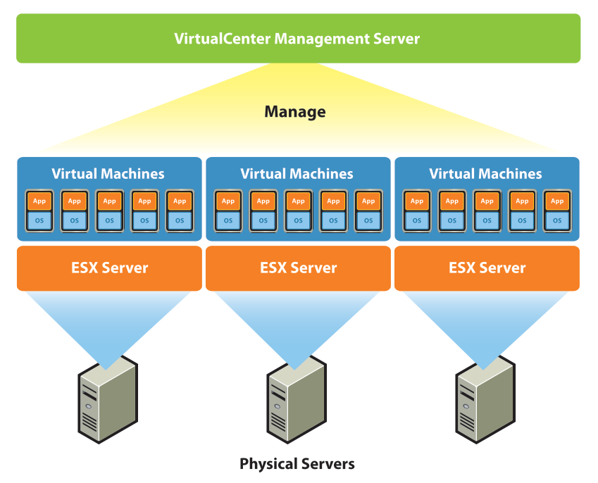

图1-3：VirtualCenter Management Server集中管理虚拟机到物理服务器的分配

> VirtualCenter Management Server 应该就是现在的 vCenter Server

万一VirtualCenter Management Server无法访问（例如，网络被切断），计算服务器也将继续运行。计算服务器可以单独管理，并将根据上次设置的资源分配继续运行其分配的虚拟机。VirtualCenter Management Server可用后，它可以再次管理整个数据中心。

VirtualCenter Management Server的体系结构将在后面的部分中详细介绍。

#### 桌面客户端

VMware Infrastructure为数据中心管理和虚拟机访问提供了一系列接口。用户可以选择最符合其需求的界面：Virtual Infrastructure Client（VI Client），通过Web浏览器进行Web访问或终端服务（如Windows Terminal Services或Xterm）。

### 虚拟数据中心架构

VMware Infrastructure虚拟化整个IT基础架构，包括服务器，存储和网络。它聚合这些异构资源，并在虚拟环境中呈现简单而统一的元素集。**借助VMware Infrastructure，IT资源可以像共享实用程序一样进行管理，并动态配置到不同的业务部门和项目，而无需担心底层硬件差异和限制。**

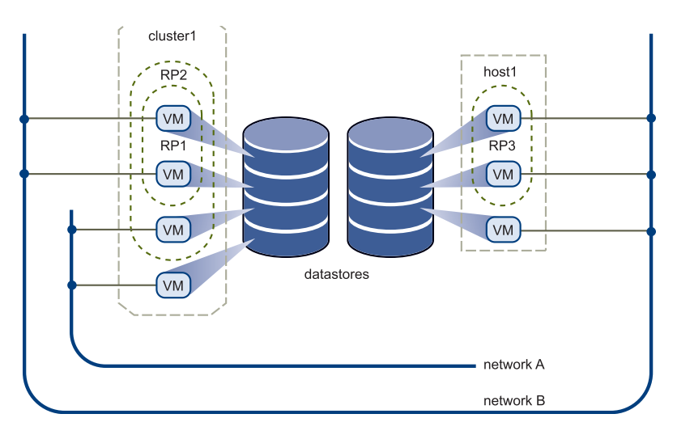

图1-4：虚拟数据中心架构

如图1-4所示，VMware Infrastructure提供了一组用于构建虚拟数据中心的简单虚拟元素：

- 计算和内存资源，又称主机，群集和资源池 (Resource Pools)
- 存储资源，又称数据存储 (Datastores)
- 网络资源，称为网络 (Networks)
- 虚拟机 (Virtual machines)

主机是运行ESX Server的物理计算机的计算和内存资源的虚拟表示形式。当一个或多个物理机器组合在一起工作并作为一个整体进行管理时，聚合计算和内存资源形成一个集群。可以从群集中动态添加或删除计算机。来自主机和群集的计算和内存资源可以精细地划分为资源池的层次结构。

数据存储是数据中心中底层物理存储资源组合的虚拟表示。这些物理存储资源可以来自服务器的本地SCSI磁盘，光纤通道SAN磁盘阵列，iSCSI SAN磁盘阵列或网络连接存储（NAS）阵列。

虚拟环境中的网络将虚拟机彼此连接或连接到虚拟数据中心外部的物理网络。

创建虚拟机时，会将虚拟机指定给特定的主机，群集或资源池以及数据存储。虚拟机消耗资源，就像物理设备消耗电力。在关机，暂停或空闲状态时，它不消耗任何资源。启动后，会动态消耗资源，随着工作负载的增加使用更多资源，或随着工作负载的减少动态归还资源。

**虚拟机的配置比物理机更快更容易。**可以在几秒钟内创建新的虚拟机，无需购买订单，无需等待，无需担心物理限制。配置虚拟机后，可以在虚拟机上不加改变地安装相应的操作系统和应用程序，以处理特定工作负载，就像它们安装在物理机器上一样。为了简化操作，甚至可以为虚拟机配置已安装和配置的操作系统和应用程序。

**根据拥有资源的系统管理员设置的策略，为虚拟机配置资源。**策略可以为特定虚拟机保留一组资源，以保证其性能。策略还可以优先化并为每个虚拟机设置总资源的可变部分。如果这样做会违反资源分配策略，则将阻止虚拟机启动（消耗资源）。有关资源管理的更多信息，请参阅“资源管理指南”。

以下部分详细介绍了数据中心的虚拟元素。

### 主机，群集和资源池

**主机，群集和资源池提供灵活且动态的方式来组织虚拟环境中的聚合计算和内存资源**，并将它们链接回底层物理资源。

主机表示物理x86服务器的聚合计算和内存资源。例如，如果物理x86服务器有四个双核CPU，每个CPU运行速度为4 GHz，系统内存为32 GB，那么主机将具有32 GHz的计算能力和32 GB的可用内存，用于运行分配的虚拟机。

群集表示共享相同网络和存储阵列的一组物理x86服务器的聚合计算和内存资源。例如，如果该组包含8个服务器，则每个服务器有4个双核CPU，每个CPU以4 GHz运行，32 GB内存。然后，群集将具有256 GHz的计算能力和256 GB的内存，可用于分配给它的正在运行的虚拟机。

虚拟资源所有者无需关心底层群集的物理组成（数量服务器，CPU的数量和类型 比如多核，超线程等）以供应资源。他们只是根据聚合可用资源设置资源配置策略。VMware Infrastructure将自动将适当的资源动态分配给这些策略边界内的虚拟机。

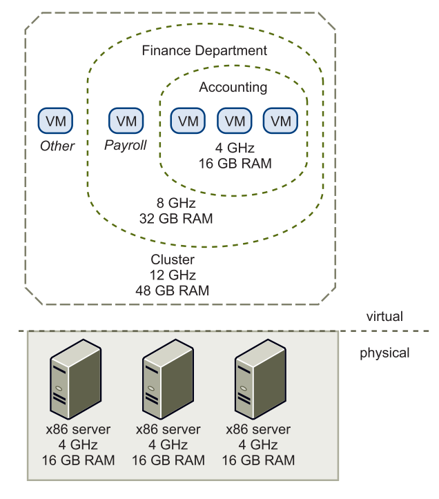

图1-5：主机，群集和资源池

资源池提供了一种灵活且动态的方式来从主机或群集中划分和组织计算和内存资源。可以将任何资源池划分为细粒度级别的较小资源池，以进一步划分资源并将资源分配给不同的组或用于不同目的。

图1-5说明了资源池的概念。三台具有4 GHz计算能力和16 GB内存的x86服务器被聚合在一起，形成12 GHz计算能力和48 GHz内存的集群。资源池（“财务部门”）保留8 GHz计算能力和32 GB的群集，为虚拟机“其他”留下4 GHz计算能力和16 GB内存。从“财务部门”资源池，较小的资源池（“会计”）为会计部门的虚拟机保留4 GHz计算能力和16 GB。这为称为“Payroll”的虚拟机留下了4 GHz和16 GB的内存。**保留的资源可以动态更改。**想象一下，在年底，会计工作量增加，用户希望将资源池“计费”从保留4 GHz的计算能力增加到6 GHz。我们可以简单地**动态更改资源池，而无需关闭关联的虚拟机。**为资源池或虚拟机保留的资源不会立即被删除。它们动态响应需求。例如，如果未使用为会计部门保留的4 GHz计算资源，则虚拟机“Payroll”可以在其高峰时间使用剩余的处理容量。当会计再次需要处理能力时，“Payroll”将动态地归还它们。因此，**即使资源是为不同资源池保留的，如果资源的所有者没有使用，也不会浪费。**

如示例所示，资源池可以嵌套，分层组织和动态重新配置，以便IT环境与公司组织匹配。各个业务部门可以使用专用的基础架构资源，同时仍然可以从资源池的效率中受益。

### VMware VMotion，VMware DRS和VMware HA

VMware VMotion，VMware DRS和VMware HA是分布式服务，可实现高效，自动化的资源管理和高虚拟机可用性。

#### VMware VMotion

如前所述，虚拟机通过VMware ESX Server在各个物理x86服务器上运行并消耗资源。VMotion支持将正在运行的虚拟机从一台物理服务器迁移到另一台物理服务器而不会中断服务，如图1-6所示。这允许虚拟机从负载很重的服务器移动到负载较轻的服务器。效果是更有效的资源分配。因此，通过VMotion，可以跨物理服务器动态地将资源重新分配给虚拟机。

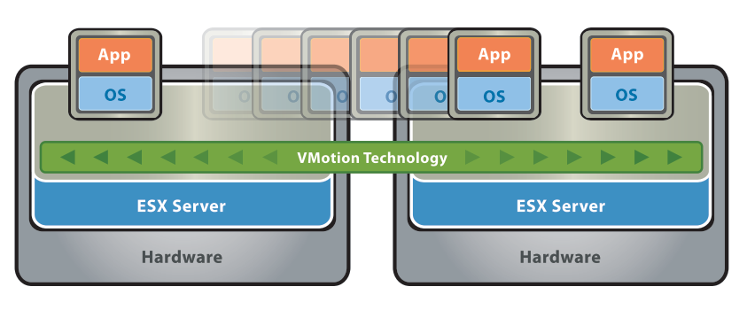

图1-6：VMware VMotion

#### VMware DRS

通过添加智能调度程序，VMotion功能更进一步，**VMware DRS使系统管理员能够设置反映业务需求的资源分配策略，并让VMware DRS进行计算并自动处理详细的物理资源分配。** VMware DRS动态监视正在运行的虚拟机的工作负载以及群集中物理服务器的资源利用率。它根据资源分配策略检查这些结果，如果存在违规或改进的可能性，它会利用VMotion并动态地将虚拟机重新分配给不同的物理服务器，如图1-7所示，以确保策略得到遵守和资源分配是最佳的。

如果新的物理服务器可用，VMware DRS会自动重新分配虚拟机以利用它。相反，如果因任何原因需要关闭物理服务器，VMware DRS会自动将其虚拟机重新分配给其他服务器。有关更多信息，请参阅VMware DRS白皮书。

> [vSphere DRS](https://vspherecentral.vmware.com/t/resource-management-and-availability/vsphere-resources-and-availability/vsphere-drs/)

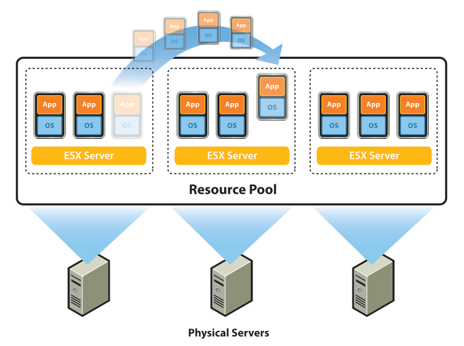

图1-7：VMware DRS

#### VMware HA

**VMware HA提供了一种简单且低成本的高可用性替代应用程序群集。** 如果托管服务器出现故障，它可以在群集内的其他物理服务器上自动快速重启虚拟机。虚拟机中的所有应用程序都将受益于高可用性，而不仅仅是应用程序集群中的应用程序。

> High Availability (HA): 指能使核心系统一直可用的特性, 这概念是和 Continuous Availability (CA) 相比较的, HA 弱一些, 允许服务在少量时间不可用, 而 CA 要保证服务一直可用
>
> 双活: 数据同时写在两个节点上, 且两个节点同时运行
>
> Disaster Recovery (DR): 这个概念同时强调两个重点: 遇事后数据不丢, 且能迅速恢复
>
> Fault Tolerance (FT): 容错, 这个概念区别于 **双活**, 只有一台虚拟机运行, 保证主节点挂掉后能切到副节点就行, 这个概念跟 CA 关系较近
>
> failover: 指失效转移的动作, 当A无法服务时, 系统能够自动切换, 使B能够及时跟上继续提供服务

VMware HA的工作原理是在每个物理服务器上放置代理，以便与群集中的其他服务器保持“心跳”。如图1-8所示，从一台服务器丢失“心跳”会自动启动其他服务器上所有受影响的虚拟机的重启。

只需指定要在群集中重新启动的虚拟机的优先级顺序，即可完成VMware HA的设置。与应用程序集群所需的设置和配置工作相比，这非常简单。此外，即使VMware HA始终需要维护一定数量的非保留资源以确保剩余的实时服务器可以处理总工作负载，但它不需要将应用程序群集等资源的数量增加一倍。有关更多信息，请参阅VMware HA白皮书。

> [VMware HA: Deployment Best Practices](https://www.vmware.com/content/dam/digitalmarketing/vmware/en/pdf/techpaper/vmw-server-wp-bestpractices-white-paper.pdf)

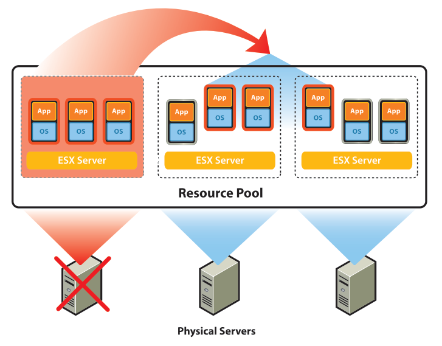

图1-8：VMware HA

### 网络架构

**VMware Infrastructure是唯一提供丰富的虚拟网络元素的解决方案**，它使数据中心中的虚拟机网络像在物理环境中一样简单和简单。此外还支持在物理环境中无法实现的一组新功能，因为物理世界中的许多限制都不适用。

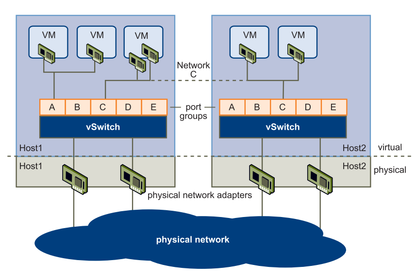

图1-9：网络架构

图1-9显示了虚拟环境内外网络之间的关系。虚拟环境提供与物理世界类似的网络元素。它们是虚拟网络接口卡（vNIC），虚拟交换机（vSwitch）和端口组。

与物理机一样，每个虚拟机都有自己的vNIC。操作系统和应用程序通过标准网络设备驱动程序或VMware优化的网络设备驱动程序与vNIC进行通信，就像vNIC是物理网卡一样。对于外部世界，每个vNIC看起来就像一个物理网卡 - 它有自己的MAC地址，一个或多个IP地址，它完全像物理网卡那样响应标准以太网协议。

vSwitch的工作方式类似于二层物理交换机。每个物理服务器都有自己的vSwitch。在vSwitch的一侧是连接到虚拟机的端口组。另一方面是vSwitch所在服务器上物理以太网适配器的上行链路连接。虚拟机通过连接到vSwitch上行链路的物理以太网适配器连接到外部世界。

虚拟交换机可以将其上行链路连接到多个物理以太网适配器，以便 **NIC组合两个或多个用于共享流量负载的物理适配器，或者在适配器硬件发生故障时提供故障转移。** 故障转移对于所有虚拟机无需专门为NIC组合配置任何虚拟机。有关NIC绑定的信息，请参阅“服务器配置指南”。

**端口组是虚拟环境中的独特概念。端口组是一种用于设置管理与其连接的网络的策略的机制。** vSwitch可以具有多个端口组。虚拟机不是连接到vSwitch上的特定端口，而是将其vNIC连接到端口组。连接到同一端口组的所有虚拟机都属于虚拟环境中的同一网络，即使它们位于不同的物理服务器上，如图1-9所示。Host1和Host2上的网络C相同。

即使满足所有其他条件，只有当两个服务器具有相同的vSwitch（具有相同的端口组）时，虚拟机才能从一个物理服务器VMotion到另一个物理服务器。遵循VMotion迁移后会保持网络连接，因为虚拟机会自动连接到新托管服务器上相同vSwitch上的同一端口组。

端口组可以配置为强制执行许多策略，以提供增强的网络安全性，网络分段，更好的性能，更高的可用性和流量管理：

- 可以为端口组设置二层安全选项，**以隔离受感染或恶意的虚拟机**，并防止它们对网络中的其他计算机造成伤害
- 可以为端口组配置VLAN支持，以允许网络分段
- 可以为单个端口组（网络）设置特定的NIC绑定策略，以共享流量负载或在出现硬件故障时提供故障转移
- 可以设置流量整形策略以改善流量管理

有关端口组配置的详细信息，请参阅“服务器配置指南”。

### 存储架构

**VMware Infrastructure可实现企业级存储性能，功能和可用性，而不会增加用户应用程序和客户机操作系统的复杂性**。

VMware Infrastructure Storage Architecture由抽象层组成，可隐藏和管理物理存储子系统之间的复杂性和差异，并为虚拟环境提供简单的标准存储元素（参见图1-10）。对于每个虚拟机内的应用程序和客户操作系统，存储简单地表示为连接到虚拟总线逻辑或LSI SCSI主机总线适配器的SCSI磁盘。

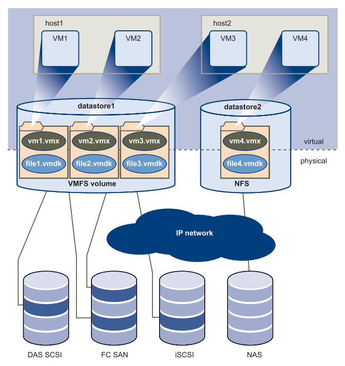

图1-10：存储架构

虚拟机内的虚拟SCSI磁盘是从数据中心的Datastore元素配置的。Datastore就像一个存储设备，为虚拟机内的虚拟磁盘提供存储空间，并自行存储虚拟机。如图1-10所示，虚拟机作为一组文件存储在Datastore的自己的目录中。每个虚拟机内的虚拟磁盘位于目录内的一个或多个文件中。因此，虚拟磁盘可以像文件一样轻松地进行操作（复制，移动，备份等）。**虚拟磁盘可以“热添加”到虚拟机而不会关闭虚拟机。**在这种情况下，会创建新的虚拟磁盘文件或将现有的虚拟磁盘文件与虚拟机关联。

数据存储提供了一种简单的模型，可以为各个虚拟机分配存储空间，而不会使它们面临各种物理存储技术的复杂性，例如光纤通道SAN，iSCSI SAN，直接连接存储和NAS。

Datastore在物理上是VMFS文件系统卷或NAS设备上的目录。每个数据存储可以跨越多个物理存储子系统。如图1-10所示，单个VMFS卷可以包含物理服务器，光纤通道SAN磁盘场或iSCSI SAN磁盘场中直接连接的SCSI磁盘阵列中的一个或多个LUN。添加到任何物理存储子系统的新LUN将自动发现并可用。可以添加它们以扩展先前创建的Datastore，而无需关闭物理服务器或存储子系统。相反，如果数据存储中的任何LUN出现故障或变得不可用，则只会影响驻留在该LUN中的那些虚拟机。驻留在其他LUN中的所有其他虚拟机将继续正常运行。

VMFS是一个集群文件系统，它利用共享存储允许多个物理服务器同时读取和写入同一存储。VMFS提供磁盘分布式锁定，以确保同一虚拟机不会同时由多个服务器启动。如果物理服务器出现故障，则可以释放每个虚拟机的磁盘锁定，以便可以在其他物理服务器上重新启动虚拟机。

VMFS还具有企业级崩溃一致性和恢复机制，例如分布式日志，崩溃一致的虚拟机IO路径和计算机状态快照。这些机制可以帮助快速进行根本原因分析，并从虚拟机，物理服务器和存储子系统故障中恢复。

VMFS还支持裸设备映射（RDM）。RDM为虚拟机提供了一种机制，可以直接访问物理存储子系统上的LUN（仅限光纤通道或iSCSI）。RDM对于支持两种典型类型的应用程序非常有用：

- SAN快照或在虚拟机中运行的其他分层应用程序。RDM可以更好地使用SAN固有的功能实现可扩展的备份卸载系统。
- Microsoft群集服务（MSCS）的任何使用都跨越物理服务器：虚拟到虚拟群集以及物理到虚拟群集。群集数据和仲裁磁盘应配置为RDM而不是共享VMFS上的文件。

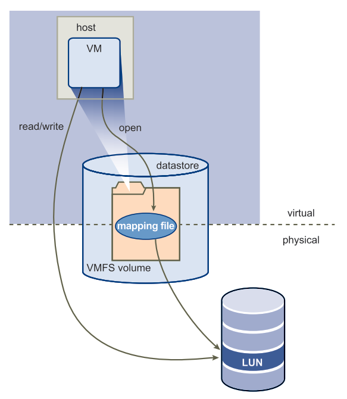

图1-11：裸设备映射

RDM可以被视为从VMFS卷到原始LUN的符号链接（参见图1-11）。映射使LUN显示为VMFS卷中的文件。 虚拟机配置中将引用映射文件 (而不是原始LUN)。打开LUN进行访问时，VMFS会将RDM文件解析为正确的物理设备，并执行适当的访问检查和锁定。此后，读取和写入将直接转到原始LUN (而不是通过映射文件)。

### VMware Consolidated Backup

VMware Infrastructure的存储架构支持简单的虚拟机备份解决方案：VMware Consolidated Backup。**Consolidated Backup为虚拟机的无代理备份提供了易于使用的集中式设施。**如图1-12所示，Consolidated Backup与驻留在单独备份代理服务器上的第三方备份代理配合使用（不在运行ESX Server的服务器上），但不需要虚拟机内的代理。第三方备份代理管理备份计划。在需要备份时启动Consolidated Backup。启动后，Consolidated Backup会运行一组预备份脚本，以使虚拟磁盘停顿以拍摄其快照。然后，它运行一组解冻后脚本，以将虚拟机恢复到正常运行状态。同时，它将磁盘快照安装到备份代理服务器。最后，第三方备份代理将已装入快照上的文件备份到其备份目标。通过虚拟磁盘快照并随时备份它们而不必担心备份窗口或需要停止应用程序，Consolidated Backup为虚拟环境提供了一种简单，低侵入性和低开销的备份解决方案。

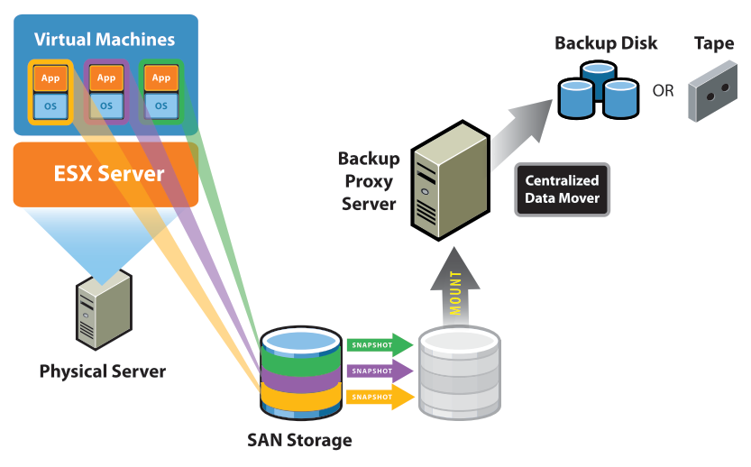

图1-12：Consolidated Backup的工作原理

### ESX Server外部接口组件

ESX Server是一个虚拟化层，它将物理服务器的处理器，内存，存储和网络资源抽象为多个虚拟机，这些虚拟机以安全且隔离的方式并行运行。在每台物理x86计算机上运行一个ESX Server副本。在本节中，仅描述了与外部世界接口的ESX Server组件，请参见图1-13。有关ESX Server的更多详细信息，请参阅其他许多ESX Server技术文档。

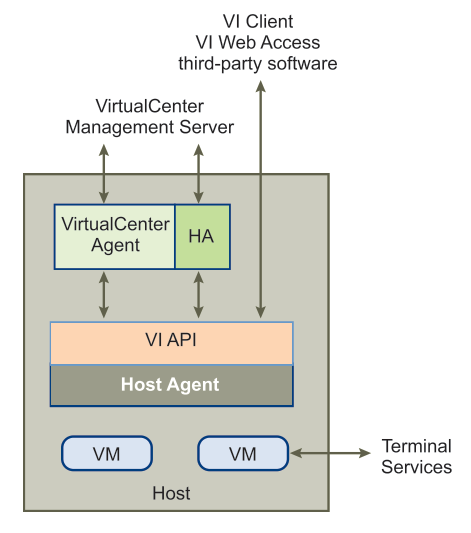

图1-13：VMware ESX Server外部接口组件

> 这里说明 vCenter Server 服务 和 HA 服务是平级的, Host 上有三种 Agent: vCenter Agent, HA Agent, 以及 Host Agent
>
> 估计现在 (2019年) 还是这个结构

ESX Server使用VMware Infrastructure API（VI API）通过其Host Agent与其他资源进行通信。使用VMware Infrastructure SDK，VMware和第三方软件都可以通过VI API从ESX Server收集信息并对其进行管理。

如前所述，VMware HA Agent提供了一个“心跳”，当心跳不存在时，群集中的其他物理服务器就会得知，于是重新启动托管服务器已关闭的虚拟机。VMware HA Agent驻留在每个物理服务器上，并与Host Agent通信，以不断检查服务器的运行状况。

当首次添加要管理的运行ESX Server的计算机时，VirtualCenter Agent Server会发送VirtualCenter Agent（VC Agent）。VC代理驻留在每台计算机上，充当VirtualCenter Management Server与其管理的ESX Server之间的代理。

VC Agent通过VI API与Host Agent通信，如图1-13所示。其主要任务是卸载 (offload) 一些特定于一台物理服务器的VirtualCenter Management Server功能。这使VirtualCenter Management Server能够扩展和管理更多数量的物理服务器，而无需按比例计算能力和网络带宽。VC Agent执行的一些关键任务是：

- 中继和实施VirtualCenter Management Server中的资源分配决策（包括VMware DRS引擎发送的决策）
- 将虚拟机配置和配置更改命令传递给Host Agent
- 将主机配置更改命令传递给Host Agent
- 通过VI API与Host Agent通信，监控和收集性能统计信息，警报和事件
- 收集一定数量的信息后，将信息传递回VirtualCenter Management Server。

> HA不受DRS和vMotion的影响，也就是说它并不依赖于后两者存在，它的心跳检测信号可以通过ESX主机之间发生。HA甚至都不依赖于vCenter服务器，不过鉴于HA的配置需要依赖vCenter，所以我们一般认为HA还是需要依赖于vCenter服务器的，但是我们必须清楚的认识：vCenter于HA的作用仅限于配置时需要它，配置完成后只要我们设定了心跳检测的隔离地址，则我们可以丢弃vCenter服务器了（前提是我们不需要用到DRS和VMotion等功能）。
>
> [vSphere 功能介绍 - HA](https://blog.51cto.com/linkinsds/416738)

### vCenter Server体系结构

> 已将这一章节中出现的所有 `VirtualCenter Management Server` 都替换为 `vCenter Server`

**vCenter Server为数据中心提供了方便的集中管理驾驶舱。** 它汇集了来自多个ESX Server安装的物理资源，并在虚拟环境中配置虚拟机时为系统管理员提供了一组简单灵活的资源。

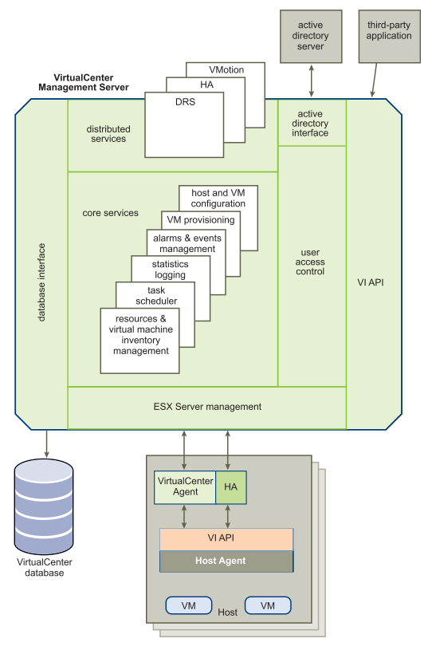

图1-14：vCenter Server组件

图1-14显示了vCenter Server的主要功能组件。它们包括用户访问控制，核心服务，分布式服务以及与外部资源的接口。

用户访问控制允许系统管理员为不同用户创建和管理对VirtualCenter的不同级别的访问。例如，可能存在管理在数据中心中配置物理服务器的用户类，并且可能存在仅管理特定资源池内的虚拟资源的不同用户类。

核心服务是虚拟数据中心的基本管理服务。它们包括以下服务：

- VM Provisioning - 指导和自动化虚拟机的配置
- 主机和VM配置 - 允许配置主机和虚拟机
- 资源和虚拟机库存管理 - 在虚拟环境中组织虚拟机和资源，并为其管理提供便利
- 统计和日志记录 - 记录和报告数据中心元素（如虚拟机，主机和集群）的性能和资源利用率统计信息
- 警报和事件管理 - 跟踪并警告用户潜在的资源过度使用或事件状况
- 任务计划程序 - 计划在给定时间发生VMotion等操作

分布式服务（如VMware DRS，VMware HA和VMware VMotion）是将VMware Infrastructure功能扩展到更高级别的解决方案。分布式服务允许从vCenter Server集中配置和管理这些解决方案。

vCenter Server有四个关键接口：

- ESX Server管理 - 与VC代理的接口，用于管理数据中心中的每个物理服务器
- VMware Infrastructure API - 与VMware管理客户端和第三方解决方案的接口
- 数据库接口 - 连接到Oracle或Microsoft SQL Server以存储诸如虚拟机配置，主机配置，资源和虚拟机清单，性能统计信息，事件，警报，用户权限和角色等信息
- Active Directory接口 - 连接到Active Directory以获取用户访问控制信息

#### 访问虚拟数据中心

用户可以通过三种不同的方式管理VMware Infrastructure数据中心或访问虚拟机控制台：VI Client，通过Web浏览器进行Web访问或终端服务（如Windows终端服务或Xterm）。

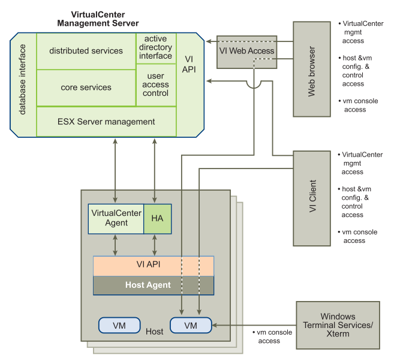

图1-15：VMware Infrastructure访问和控制

vCenter Server和VMware ESX Server均可通过VMware Infrastructure工具或第三方工具通过VI API进行管理。

直接管理ESX Server应由物理服务器管理员在特殊情况下完成。可以在ESX Server上执行的所有管理功能也可以在vCenter Server中完成。

使用VI Client，用户可以管理数据中心的物理和虚拟资源。访问vCenter Server时，会在用户通过身份验证后启动会话。身份验证后，将显示属于该用户的资源和虚拟机的视图。为了直接访问虚拟机控制台，VI Client首先通过VI API从vCenter Server获取虚拟机位置。然后，它直接连接到相应的ESX Server，并显示相应的虚拟机控制台。

使用Web浏览器，用户可以管理虚拟资源并访问虚拟机控制台。用户可以通过VirtualCenter首先将Web浏览器指向VI Web Access来完成此操作。VI Web Access通过VI API调解浏览器与vCenter Server之间的通信。要通过Web浏览器访问虚拟机控制台，用户可以使用vCenter Server创建的书签。书签首先指向VI Web Access。VI Web Access会解析虚拟机的物理位置，然后将Web浏览器重定向到虚拟机所在的相应ESX Server。

当然，用户可以通过使用Windows终端服务或Xterm等标准工具访问虚拟机控制台，就像访问物理机一样。

### 结论

在市场上的所有虚拟化解决方案中，只有VMware Infrastructure从头开始构建，使客户能够将虚拟化的优势带到整个企业平台，包括服务器，存储和网络系统。VMware Infrastructure不仅使客户能够构建与物理世界中可用功能相匹配的整个虚拟数据中心，而且还通过提供物理成本过高或不可能的灵活性和控制来更进一步。

借助虚拟VMware VMotion，VMware DRS，VMware HA和VMware Consolidated Backup等全套补充虚拟化和管理服务，VMware Infrastructure是唯一能够为客户构建数据中心提供完整解决方案而非零碎方案的产品在虚拟环境中。

VMware Infrastructure是第一个虚拟化x86平台的第三代产品，它开发了大型第三方解决方案生态系统，并享有行业范围的硬件和软件认证支持。自1998年成立以来，它已经在一些最苛刻和最大的IT生产环境中进行了生产测试和部署。VMware Infrastructure是唯一可供企业IT部门进行企业级部署的虚拟化解决方案。

